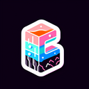

# Basalt

**Tier**: 4

Forged in the depths of the earth, harder than your ex's heart and cooler than the underside of your pillow.

## How to make?

* Combine [Water](/wiki/elements/water) and [Lava](/wiki/elements/lava) to make [Basalt](/wiki/elements/basalt). This process is known as [Make Basalt](/wiki/recipes/make-basalt).

## How to use?

_Basalt is not used for crafting in any recipes. You can still sacrifice it though with the **Sacrifice** button._

## See also

* [Games](/wiki/games)
* [Elements](/wiki/elements)
* [Recipes](/wiki/recipes)
* [Wiki](/wiki/index)
* [Learn](/learn/index)