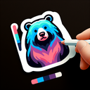

# Bear

**Tier**: 1

This fuzzy giant decided to move out of the forest and into your nightmares on the advice of its therapist, Yogi.

## How to make?

_There is no way to make Bear. You can buy it from the game, by pressing the **Buy** button._

## How to use?

* Combine [Bee](/wiki/elements/bee) and [Bear](/wiki/elements/bear) to make [Beer](/wiki/elements/beer). This process is known as [Make Beer](/wiki/recipes/make-beer).

## See also

* [Games](/wiki/games)
* [Elements](/wiki/elements)
* [Recipes](/wiki/recipes)
* [Wiki](/wiki/index)
* [Learn](/learn/index)