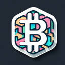

# Blockchain

**Tier**: 1

The magical internet ledger of destiny that Satoshi dreamt up, where everything is transparent, immutable, and forever entwined like the plot of a Christopher Nolan movie.

## How to make?

_There is no way to make Blockchain. You can buy it from the game, by pressing the **Buy** button._

## How to use?

* Combine [Blockchain](/wiki/elements/blockchain) and [Peer Review](/wiki/elements/peer-review) to make [Cardano](/wiki/elements/cardano). This process is known as [Make Cardano](/wiki/recipes/make-cardano).

## See also

* [Games](/wiki/games)
* [Elements](/wiki/elements)
* [Recipes](/wiki/recipes)
* [Wiki](/wiki/index)
* [Learn](/learn/index)