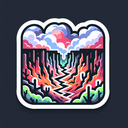

# Charred Ravine

**Tier**: 1

A spicy hot potato chip of doom, hotter than a dragon's sneeze in a volcano.

## How to make?

* Combine [Fire](/wiki/elements/fire) and [Ravine](/wiki/elements/ravine) to make [Charred Ravine](/wiki/elements/charred-ravine). This process is known as [Make Charred Ravine](/wiki/recipes/make-charred-ravine).

## See also

* [Games](/wiki/games)
* [Elements](/wiki/elements)
* [Recipes](/wiki/recipes)
* [Wiki](/wiki/index)
* [Learn](/learn/index)