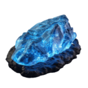

# Crystal

**Tier**: 1

Shiny as Edward Cullen and twice as sparkly in the moonlight!

## How to make?

* Combine [Glass](/wiki/elements/glass) and [Earth](/wiki/elements/earth) to make [Crystal](/wiki/elements/crystal). This process is known as [Make Crystal](/wiki/recipes/make-crystal).

## How to use?

* Combine [Fire](/wiki/elements/fire) and [Crystal](/wiki/elements/crystal) to make [Molten Glass](/wiki/elements/molten-glass). This process is known as [Make Molten Glass](/wiki/recipes/make-molten-glass).
* Combine [Water](/wiki/elements/water) and [Crystal](/wiki/elements/crystal) to make [Prism](/wiki/elements/prism). This process is known as [Make Prism](/wiki/recipes/make-prism).
* Combine [Wind](/wiki/elements/wind) and [Crystal](/wiki/elements/crystal) to make [Sparkle](/wiki/elements/sparkle). This process is known as [Make Sparkle](/wiki/recipes/make-sparkle).

## See also

* [Games](/wiki/games)
* [Elements](/wiki/elements)
* [Recipes](/wiki/recipes)
* [Wiki](/wiki/index)
* [Learn](/learn/index)