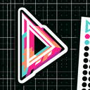

# Delta

**Tier**: 20

The river’s final boss battle, where water splits like an indecisive rom-com character in the season finale.

## How to make?

* Combine [Earth](/wiki/elements/earth) and [River](/wiki/elements/river) to make [Delta](/wiki/elements/delta). This process is known as [Make Delta](/wiki/recipes/make-delta).

## How to use?

* Combine [Water](/wiki/elements/water) and [Delta](/wiki/elements/delta) to make [Estuary](/wiki/elements/estuary). This process is known as [Make Estuary](/wiki/recipes/make-estuary).
* Combine [Fire](/wiki/elements/fire) and [Delta](/wiki/elements/delta) to make [Fire Swamp](/wiki/elements/fire-swamp). This process is known as [Make Fire Swamp](/wiki/recipes/make-fire-swamp).
* Combine [Wind](/wiki/elements/wind) and [Delta](/wiki/elements/delta) to make [Riverbank](/wiki/elements/riverbank). This process is known as [Make Riverbank](/wiki/recipes/make-riverbank).

## See also

* [Games](/wiki/games)
* [Elements](/wiki/elements)
* [Recipes](/wiki/recipes)
* [Wiki](/wiki/index)
* [Learn](/learn/index)