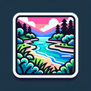

# Estuary

**Tier**: 1

Where the river meets the sea, like the ultimate mashup album nobody asked for but everyone loves.

## How to make?

* Combine [Water](/wiki/elements/water) and [Delta](/wiki/elements/delta) to make [Estuary](/wiki/elements/estuary). This process is known as [Make Estuary](/wiki/recipes/make-estuary).

## See also

* [Games](/wiki/games)
* [Elements](/wiki/elements)
* [Recipes](/wiki/recipes)
* [Wiki](/wiki/index)
* [Learn](/learn/index)