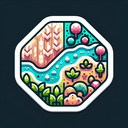

# Fertile Land

**Tier**: 1

As luxurious and bountiful as Bob Ross’s paint palette, it's the MVP of Mother Nature's garden party.

## How to make?

* Combine [Earth](/wiki/elements/earth) and [Soil](/wiki/elements/soil) to make [Fertile Land](/wiki/elements/fertile-land). This process is known as [Make Fertile Land](/wiki/recipes/make-fertile-land).

## See also

* [Games](/wiki/games)
* [Elements](/wiki/elements)
* [Recipes](/wiki/recipes)
* [Wiki](/wiki/index)
* [Learn](/learn/index)