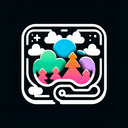

# Forest

**Tier**: 1

A dense collection of trees where even squirrels hire GPS, home of the mythical Wi-Fi-repellent green zone.

## How to make?

* Combine [Plant](/wiki/elements/plant) and [Earth](/wiki/elements/earth) to make [Forest](/wiki/elements/forest). This process is known as [Make Forest](/wiki/recipes/make-forest).

## How to use?

* Combine [Forest](/wiki/elements/forest) and [Fire](/wiki/elements/fire) to make [Wildfire](/wiki/elements/wildfire). This process is known as [Make Wildfire](/wiki/recipes/make-wildfire).
* Combine [Forest](/wiki/elements/forest) and [Earth](/wiki/elements/earth) to make [Jungle](/wiki/elements/jungle). This process is known as [Make Jungle](/wiki/recipes/make-jungle).

## See also

* [Games](/wiki/games)
* [Elements](/wiki/elements)
* [Recipes](/wiki/recipes)
* [Wiki](/wiki/index)
* [Learn](/learn/index)