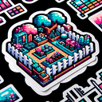

# Garden

**Tier**: 1

Nature's sunlit Wi-Fi free zone, and the original farm-to-table restaurant!

## How to make?

* Combine [Earth](/wiki/elements/earth) and [Plant](/wiki/elements/plant) to make [Garden](/wiki/elements/garden). This process is known as [Make Garden](/wiki/recipes/make-garden).

## How to use?

* Combine [Water](/wiki/elements/water) and [Garden](/wiki/elements/garden) to make [Pond](/wiki/elements/pond). This process is known as [Make Pond](/wiki/recipes/make-pond).
* Combine [Wind](/wiki/elements/wind) and [Garden](/wiki/elements/garden) to make [Aromas](/wiki/elements/aromas). This process is known as [Make Aromas](/wiki/recipes/make-aromas).

## See also

* [Games](/wiki/games)
* [Elements](/wiki/elements)
* [Recipes](/wiki/recipes)
* [Wiki](/wiki/index)
* [Learn](/learn/index)