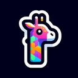

# Giraffe

**Tier**: 1

The long-necked, leafy buffet enthusiast that would make even a stepladder feel short.

## How to make?

_There is no way to make Giraffe. You can buy it from the game, by pressing the **Buy** button._

## How to use?

* Combine [Giraffe](/wiki/elements/giraffe) and [Giraffe](/wiki/elements/giraffe) to make [Hydra](/wiki/elements/hydra). This process is known as [Make Hydra](/wiki/recipes/make-hydra).

## See also

* [Games](/wiki/games)
* [Elements](/wiki/elements)
* [Recipes](/wiki/recipes)
* [Wiki](/wiki/index)
* [Learn](/learn/index)