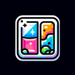

# Glass

**Tier**: 7

As delicate as your ego after a bad break-up, but see-through like your best friend's terrible poker face.

## How to make?

* Combine [Sand](/wiki/elements/sand) and [Fire](/wiki/elements/fire) to make [Glass](/wiki/elements/glass). This process is known as [Make Glass](/wiki/recipes/make-glass).

## How to use?

* Combine [Glass](/wiki/elements/glass) and [Water](/wiki/elements/water) to make [Frosted Glass](/wiki/elements/frosted-glass). This process is known as [Make Frosted Glass](/wiki/recipes/make-frosted-glass).
* Combine [Glass](/wiki/elements/glass) and [Earth](/wiki/elements/earth) to make [Crystal](/wiki/elements/crystal). This process is known as [Make Crystal](/wiki/recipes/make-crystal).

## See also

* [Games](/wiki/games)
* [Elements](/wiki/elements)
* [Recipes](/wiki/recipes)
* [Wiki](/wiki/index)
* [Learn](/learn/index)