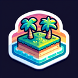

# Island

**Tier**: 1

A chunk of land adrift in the ocean, like a slice of pizza floating in tomato soup.

## How to make?

* Combine [Earth](/wiki/elements/earth) and [Lake](/wiki/elements/lake) to make [Island](/wiki/elements/island). This process is known as [Make Island](/wiki/recipes/make-island).

## See also

* [Games](/wiki/games)
* [Elements](/wiki/elements)
* [Recipes](/wiki/recipes)
* [Wiki](/wiki/index)
* [Learn](/learn/index)