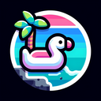

# Lagoon

**Tier**: 45

A lazy lake who's too cool to hang with the ocean, featuring more zen than a yoga retreat for dolphins.

## How to make?

* Combine [Water](/wiki/elements/water) and [Lake](/wiki/elements/lake) to make [Lagoon](/wiki/elements/lagoon). This process is known as [Make Lagoon](/wiki/recipes/make-lagoon).

## How to use?

* Combine [Earth](/wiki/elements/earth) and [Lagoon](/wiki/elements/lagoon) to make [Reef](/wiki/elements/reef). This process is known as [Make Reef](/wiki/recipes/make-reef).

## See also

* [Games](/wiki/games)
* [Elements](/wiki/elements)
* [Recipes](/wiki/recipes)
* [Wiki](/wiki/index)
* [Learn](/learn/index)