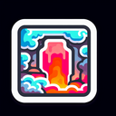

# Lava Cave

**Tier**: 16

A fiery Airbnb for fire-breathing dragons and grilled marshmallows.

## How to make?

* Combine [Fire](/wiki/elements/fire) and [Cave](/wiki/elements/cave) to make [Lava Cave](/wiki/elements/lava-cave). This process is known as [Make Lava Cave](/wiki/recipes/make-lava-cave).

## How to use?

_Lava Cave is not used for crafting in any recipes. You can still sacrifice it though with the **Sacrifice** button._

## See also

* [Games](/wiki/games)
* [Elements](/wiki/elements)
* [Recipes](/wiki/recipes)
* [Wiki](/wiki/index)
* [Learn](/learn/index)