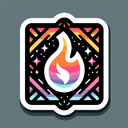

# Magma

**Tier**: 1

Hotter than your ex's last text, this molten rock sauce will turn enemies into toast.

## How to make?

* Combine [Obsidian](/wiki/elements/obsidian) and [Fire](/wiki/elements/fire) to make [Magma](/wiki/elements/magma). This process is known as [Make Magma](/wiki/recipes/make-magma).

## How to use?

_Magma is not used for crafting in any recipes. You can still sacrifice it though with the **Sacrifice** button._

## See also

* [Games](/wiki/games)
* [Elements](/wiki/elements)
* [Recipes](/wiki/recipes)
* [Wiki](/wiki/index)
* [Learn](/learn/index)