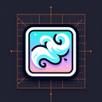

# Mist

**Tier**: 1

Like a ghost doing the moonwalk, it slips through your fingers and cloaks the world in mystery!

## How to make?

* Combine [Fog](/wiki/elements/fog) and [Earth](/wiki/elements/earth) to make [Mist](/wiki/elements/mist). This process is known as [Make Mist](/wiki/recipes/make-mist).

## See also

* [Games](/wiki/games)
* [Elements](/wiki/elements)
* [Recipes](/wiki/recipes)
* [Wiki](/wiki/index)
* [Learn](/learn/index)