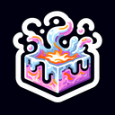

# Molten Glass

**Tier**: 1

Hotter than a dragon's breath after Taco Tuesday, this molten glass can melt through your problems... literally.

## How to make?

* Combine [Fire](/wiki/elements/fire) and [Crystal](/wiki/elements/crystal) to make [Molten Glass](/wiki/elements/molten-glass). This process is known as [Make Molten Glass](/wiki/recipes/make-molten-glass).

## How to use?

_Molten Glass is not used for crafting in any recipes. You can still sacrifice it though with the **Sacrifice** button._

## See also

* [Games](/wiki/games)
* [Elements](/wiki/elements)
* [Recipes](/wiki/recipes)
* [Wiki](/wiki/index)
* [Learn](/learn/index)