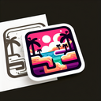

# Oasis

**Tier**: 1

The desert's VIP lounge, complete with complimentary palm trees and mirage-resistant seating!

## How to make?

* Combine [Water](/wiki/elements/water) and [Desert](/wiki/elements/desert) to make [Oasis](/wiki/elements/oasis). This process is known as [Make Oasis](/wiki/recipes/make-oasis).

## How to use?

_Oasis is not used for crafting in any recipes. You can still sacrifice it though with the **Sacrifice** button._

## See also

* [Games](/wiki/games)
* [Elements](/wiki/elements)
* [Recipes](/wiki/recipes)
* [Wiki](/wiki/index)
* [Learn](/learn/index)