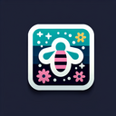

# Pollination

**Tier**: 1

Nature's Tinder for plants, where bees are the swiping right matchmakers.

## How to make?

* Combine [Wind](/wiki/elements/wind) and [Plant](/wiki/elements/plant) to make [Pollination](/wiki/elements/pollination). This process is known as [Make Pollination](/wiki/recipes/make-pollination).

## How to use?

* Combine [Water](/wiki/elements/water) and [Pollination](/wiki/elements/pollination) to make [Flower](/wiki/elements/flower). This process is known as [Make Flower](/wiki/recipes/make-flower).
* Combine [Fire](/wiki/elements/fire) and [Pollination](/wiki/elements/pollination) to make [Spore](/wiki/elements/spore). This process is known as [Make Spore](/wiki/recipes/make-spore).
* Combine [Wind](/wiki/elements/wind) and [Pollination](/wiki/elements/pollination) to make [Spread](/wiki/elements/spread). This process is known as [Make Spread](/wiki/recipes/make-spread).

## See also

* [Games](/wiki/games)
* [Elements](/wiki/elements)
* [Recipes](/wiki/recipes)
* [Wiki](/wiki/index)
* [Learn](/learn/index)