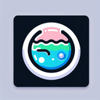

# Pond

**Tier**: 1

Where ducks hold their secret aquatic raves and lily pads plot world domination.

## How to make?

* Combine [Water](/wiki/elements/water) and [Garden](/wiki/elements/garden) to make [Pond](/wiki/elements/pond). This process is known as [Make Pond](/wiki/recipes/make-pond).

## See also

* [Games](/wiki/games)
* [Elements](/wiki/elements)
* [Recipes](/wiki/recipes)
* [Wiki](/wiki/index)
* [Learn](/learn/index)