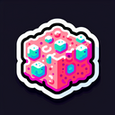

# Pumice

**Tier**: 4

Floats like a butterfly, scrubs like Mr. Clean - the Swiss cheese of rocks!

## How to make?

* Combine [Water](/wiki/elements/water) and [Ash](/wiki/elements/ash) to make [Pumice](/wiki/elements/pumice). This process is known as [Make Pumice](/wiki/recipes/make-pumice).

## How to use?

_Pumice is not used for crafting in any recipes. You can still sacrifice it though with the **Sacrifice** button._

## See also

* [Games](/wiki/games)
* [Elements](/wiki/elements)
* [Recipes](/wiki/recipes)
* [Wiki](/wiki/index)
* [Learn](/learn/index)