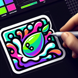

# Quicklime

**Tier**: 56

Just add water and watch this rock go all 'Hulk Smash' on your hydration dreams!

## How to make?

* Combine [Fire](/wiki/elements/fire) and [Limestone](/wiki/elements/limestone) to make [Quicklime](/wiki/elements/quicklime). This process is known as [Make Quicklime](/wiki/recipes/make-quicklime).

## How to use?

_Quicklime is not used for crafting in any recipes. You can still sacrifice it though with the **Sacrifice** button._

## See also

* [Games](/wiki/games)
* [Elements](/wiki/elements)
* [Recipes](/wiki/recipes)
* [Wiki](/wiki/index)
* [Learn](/learn/index)