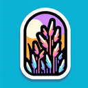

# Reeds

**Tier**: 1

The nature-made cocktail straws that just might call Gandalf from Middle-earth; beware of hobbits sneaking around!

## How to make?

* Combine [Wind](/wiki/elements/wind) and [Wetland](/wiki/elements/wetland) to make [Reeds](/wiki/elements/reeds). This process is known as [Make Reeds](/wiki/recipes/make-reeds).

## See also

* [Games](/wiki/games)
* [Elements](/wiki/elements)
* [Recipes](/wiki/recipes)
* [Wiki](/wiki/index)
* [Learn](/learn/index)