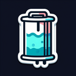

# Reservoir

**Tier**: 38

Hoarder of H2O: Where all the local water droplets hang out and gossip about breaking dams and making waves!

## How to make?

* Combine [Water](/wiki/elements/water) and [Groundwater](/wiki/elements/groundwater) to make [Reservoir](/wiki/elements/reservoir). This process is known as [Make Reservoir](/wiki/recipes/make-reservoir).

## How to use?

* Combine [Earth](/wiki/elements/earth) and [Reservoir](/wiki/elements/reservoir) to make [Basin](/wiki/elements/basin). This process is known as [Make Basin](/wiki/recipes/make-basin).

## See also

* [Games](/wiki/games)
* [Elements](/wiki/elements)
* [Recipes](/wiki/recipes)
* [Wiki](/wiki/index)
* [Learn](/learn/index)