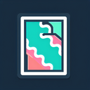

# Riverbank

**Tier**: 1

Where Gandalf would come for a picnic with his hobbit homies if Middle-earth had longer vacations.

## How to make?

* Combine [Wind](/wiki/elements/wind) and [Delta](/wiki/elements/delta) to make [Riverbank](/wiki/elements/riverbank). This process is known as [Make Riverbank](/wiki/recipes/make-riverbank).

## How to use?

_Riverbank is not used for crafting in any recipes. You can still sacrifice it though with the **Sacrifice** button._

## See also

* [Games](/wiki/games)
* [Elements](/wiki/elements)
* [Recipes](/wiki/recipes)
* [Wiki](/wiki/index)
* [Learn](/learn/index)