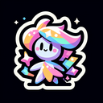

# Sparkle

**Tier**: 1

Glitter brighter than a unicorn's tears at a K-pop concert.

## How to make?

* Combine [Wind](/wiki/elements/wind) and [Crystal](/wiki/elements/crystal) to make [Sparkle](/wiki/elements/sparkle). This process is known as [Make Sparkle](/wiki/recipes/make-sparkle).

## See also

* [Games](/wiki/games)
* [Elements](/wiki/elements)
* [Recipes](/wiki/recipes)
* [Wiki](/wiki/index)
* [Learn](/learn/index)