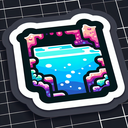

# Subterranean Pool

**Tier**: 20

Where the Teenage Mutant Ninja Turtles learned to swim and rediscover lost rubber duckies!

## How to make?

* Combine [Earth](/wiki/elements/earth) and [Underground Lake](/wiki/elements/underground-lake) to make [Subterranean Pool](/wiki/elements/subterranean-pool). This process is known as [Make Subterranean Pool](/wiki/recipes/make-subterranean-pool).

## How to use?

* Combine [Water](/wiki/elements/water) and [Subterranean Pool](/wiki/elements/subterranean-pool) to make [Spring](/wiki/elements/spring). This process is known as [Make Spring](/wiki/recipes/make-spring).
* Combine [Fire](/wiki/elements/fire) and [Subterranean Pool](/wiki/elements/subterranean-pool) to make [Hot Spring](/wiki/elements/hot-spring). This process is known as [Make Hot Spring](/wiki/recipes/make-hot-spring).
* Combine [Wind](/wiki/elements/wind) and [Subterranean Pool](/wiki/elements/subterranean-pool) to make [Grotto](/wiki/elements/grotto). This process is known as [Make Grotto](/wiki/recipes/make-grotto).

## See also

* [Games](/wiki/games)
* [Elements](/wiki/elements)
* [Recipes](/wiki/recipes)
* [Wiki](/wiki/index)
* [Learn](/learn/index)