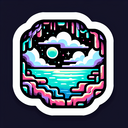

# Underground Lake

**Tier**: 1

The Batcave of aquatic hideaways, home to timid fish and overly ambitious spelunkers alike.

## How to make?

* Combine [Water](/wiki/elements/water) and [Cave](/wiki/elements/cave) to make [Underground Lake](/wiki/elements/underground-lake). This process is known as [Make Underground Lake](/wiki/recipes/make-underground-lake).

## How to use?

* Combine [Earth](/wiki/elements/earth) and [Underground Lake](/wiki/elements/underground-lake) to make [Subterranean Pool](/wiki/elements/subterranean-pool). This process is known as [Make Subterranean Pool](/wiki/recipes/make-subterranean-pool).

## See also

* [Games](/wiki/games)
* [Elements](/wiki/elements)
* [Recipes](/wiki/recipes)
* [Wiki](/wiki/index)
* [Learn](/learn/index)