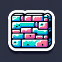

# Wall

**Tier**: 8

The Gentleman Bouncer of your castle, politely informing intruders that the party's over.

## How to make?

* Combine [Earth](/wiki/elements/earth) and [Brick](/wiki/elements/brick) to make [Wall](/wiki/elements/wall). This process is known as [Make Wall](/wiki/recipes/make-wall).

## How to use?

* Combine [Water](/wiki/elements/water) and [Wall](/wiki/elements/wall) to make [Dam](/wiki/elements/dam). This process is known as [Make Dam](/wiki/recipes/make-dam).
* Combine [Fire](/wiki/elements/fire) and [Wall](/wiki/elements/wall) to make [Firewall](/wiki/elements/firewall). This process is known as [Make Firewall](/wiki/recipes/make-firewall).
* Combine [Wind](/wiki/elements/wind) and [Wall](/wiki/elements/wall) to make [Barricade](/wiki/elements/barricade). This process is known as [Make Barricade](/wiki/recipes/make-barricade).

## See also

* [Games](/wiki/games)
* [Elements](/wiki/elements)
* [Recipes](/wiki/recipes)
* [Wiki](/wiki/index)
* [Learn](/learn/index)