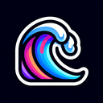

# Wave

**Tier**: 45

Surf's up, dude–ride this aquatic rollercoaster like a water wizard!

## How to make?

* Combine [Wind](/wiki/elements/wind) and [Lake](/wiki/elements/lake) to make [Wave](/wiki/elements/wave). This process is known as [Make Wave](/wiki/recipes/make-wave).

## How to use?

_Wave is not used for crafting in any recipes. You can still sacrifice it though with the **Sacrifice** button._

## See also

* [Games](/wiki/games)
* [Elements](/wiki/elements)
* [Recipes](/wiki/recipes)
* [Wiki](/wiki/index)
* [Learn](/learn/index)