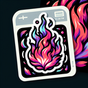

# Wildfire

**Tier**: 1

Spicier than your ex's DMs, this blaze turns forests into toast and marshmallows into napalm.

## How to make?

* Combine [Forest](/wiki/elements/forest) and [Fire](/wiki/elements/fire) to make [Wildfire](/wiki/elements/wildfire). This process is known as [Make Wildfire](/wiki/recipes/make-wildfire).

## See also

* [Games](/wiki/games)
* [Elements](/wiki/elements)
* [Recipes](/wiki/recipes)
* [Wiki](/wiki/index)
* [Learn](/learn/index)